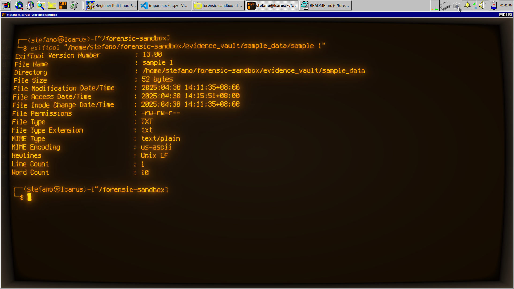

# 🕵️ Forensic Sandbox (Kali Linux)

This project is a beginner-friendly forensic analysis environment built using Kali Linux. It's designed for analyzing suspicious or unknown files in a controlled setting — without needing external drives or VMs.

### 🔎 Example: Metadata Extraction with ExifTool




## 📁 Project Structure

```forensic-sandbox/ 
    ├── evidence_vault/ # Stores sample data for analysis 
    │ └── sample_data/ # Example files (txt, images, docs, etc.)
    ├── recovered_files/ # Output from recovery tools like foremost
    ├── logs/ # Stores analysis logs
    └── scripts/ # Any custom analysis or automation scripts
```
    

## 🧪 Tools Used

- `exiftool` – metadata extraction
- `foremost` – file carving / deleted file recovery
- `file` – file type identification
- `strings` – extract readable strings from binaries
- `hexdump` – low-level file inspection

## 🛠️ Setup

1. Make project directories:
```
   ```bash
      mkdir -p ~/forensic-sandbox/{evidence_vault/sample_data,recovered_files,logs,scripts}
```
  
2. (Optional) Create test files:
```
   echo "Test file one" > ~/forensic-sandbox/evidence_vault/sample_data/test1.txt
   echo "Another sample" > ~/forensic-sandbox/evidence_vault/sample_data/test2.txt
```

3. Install tools:
```
    sudo apt update
    sudo apt install exiftool foremost
```

# 🔍 Sample Analysis Workflow

1. Identify file types:
```
```file ~/forensic-sandbox/evidence_vault/sample_data/*
```

2. Extract metadata:
```
```exiftool ~/forensic-sandbox/evidence_vault/sample_data/test1.txt
```

3. Carve for deleted files:
```
```sudo foremost -i ~/forensic-sandbox/evidence_vault/sample_data/test1.txt -o ~/forensic-sandbox/recovered_files/
```

4. Extract strings:
```
```strings ~/forensic-sandbox/evidence_vault/sample_data/test1.txt
```

5. Log your findings:
```
```echo "Sample findings..." >> ~/forensic-sandbox/logs/session1.log
```

